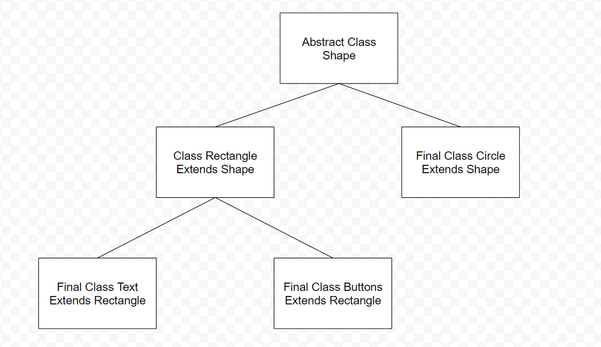

# Final-Project
## What is the Project?
- This project is a pong game ([Wikipedia](https://en.wikipedia.org/wiki/Pong))
- This project is written in the processing language ([Processing Documentation](https://processing.org/reference))
## Purpose and Personal Interest 
- **Purpose:** To demonstrate my knowledge in the processing language and understanding of object orientated programming principles alongside other curricular outcomes of advanced computer science
- **Personal Interest:** My personal interest in completing this project is because after writing and rewriting pong so many times in class, I wanted to finish this course with the best version of pong that I could create
## Features and Easter Eggs
- All basic features of pong gone over in class
- Easter Eggs: If the left score and right score equal to three a special interaction occurs
- Additional Features: If one player wins they recieve a celebration of circles
- When a goal is scored a small piece of the goal scoarers paddle falls off to make it fair, and the screen shows a message congratulation the player for scoring
- There are buttons for starting the game, exiting the game (while the game is on instructions mode, and when the screen mode is in portrait), and restarting the game (while the game is being played, and when the game is won)
- Although buttons are present in the game, all keypress commands are still available, as if the user does not have a mouse, using a trackpad to click buttons can be inconvienient 
## Unfinished Features
- Full Android Support: At the moment, only a few key features are available through mousePressed, with many features still utilizing keyPressed. For a full port to the Android operating system, touch screen support needs to be added to the following features: Paddle Movement, paddle speed settings, ball speed settings, multiplayer vs singleplayer vs screensaver, and nightmode vs daymode.
- Online Multiplayer Support: Use computer networking principles and webhosting to allow for online multiplayer pong games.
- Different Background Themes and Theme Selection: Allow the user to select a background to play pong on such as a tennis court, a badminton court, or a table tennis table. 
## Class Flow Chart

## Class Design and Constructors
- Abstract Class Shape
  - The constructor contains source variables that all subclasses use, all core variables are both gotten and set from the variables found in shapes
- Circle Class
  - The first constructor creates the balls that are used to play the game
  - The second constructor is used to create the victory animation
- Rectangle Class
  - The first constructor is used to create the paddles, scoreboard, and left / right goal score backgrounds
  - The second constructor is used to create the animation of the paddle reducing in size after each goal is scored
- Text Class
  - The first constructor is used for single lines of text such as the score 
  - The second constructor is used for multiple lines of text such as the instructions
 - Buttons 
  - The constructor is used to create the elements needed for the button to be visible, have text on it, and the parameters needed to control button clicks. Hover functionality has also been added to the buttons
## Game Instructions
**All Instructions are present in the game, however they have also been added below:**
- Please set your screen in landscape mode
- For single player: press j (You control the left paddle)
- To turn off single player: press z
- For screen saver: press f
- To turn off screen saver: press z
- To turn on night mode: press q
- To turn off night mode: press e
- To move the left paddle up, press w
- To move the left paddle down, press s
- To move the right paddle up, press the up key
- To move the right paddle down, press the down key
- For Left Paddle Speed, Press n (hard), r (normal), g (easy)
- For Right Paddle Speed, Press m (hard), t (normal), h (easy)
- By default both of these speed parameters are set to easy
- To reset game press z
- Click any number key beteween 1-9 if you want to add or remove balls (there is one ball by default)
- A point is scored by getting a point into the enemy players net, or in the case of single player mode, hitting the ball 
- First one to 5 points wins!!
- Press i to close this window! It can be reopened any time you need to see the instructions or take a break!
- You can use the o(easy), u(normal), and p(hard) keys to set the ball speed. By default, the speed is set to easy
- If the addition of the left and right scoreboard equals 3, try clicking anywhere in the middle of the screen!
- Feel Free using key presses or mouse presses to complete commands
## Release Link and Running Instructions
- To be written upon project completion
